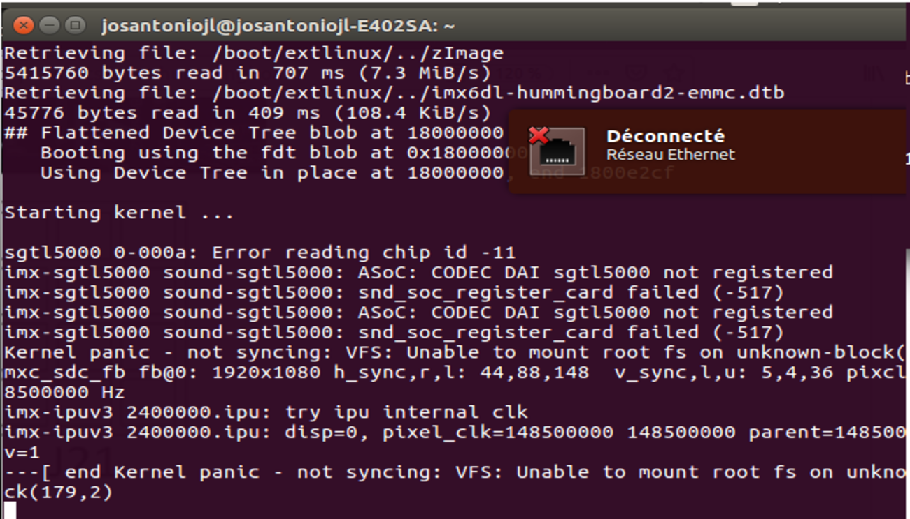
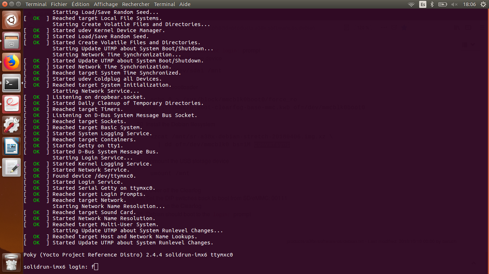

=================
3. Resultats
=================

Comme toutes les étapes ont été correctement exécutées (2.1-2.6), le système fonctionne comme suit:

.. raw:: html

	<video tyle="display:block; margin: 0 auto;" controls width="315" height="560" src="_static/Resultat.mp4"></video> 

Pour arrêter le service, le process suivante doit être effectuée :

.. raw:: html

	

	   <video controls width="315" height="560" src="_static/Resultat2.mp4"></video> 
	

Lorsque l'image est enregistrée dans la mémoire emmc et que la configuration des ''Jumpers'' est effectuée, le message d'erreur suivant s'affiche:

Pour corriger l'erreur, il est nécessaire de changer la position des ''Jumpers'' et d'effectuer les changements décrits précédemment (2.7). Le système se chargera complètement depuis la mémoire emmc sans avoir besoin de la carte micro SD:

